# JaveWheels

## Descripción

JaveWheels es una aplicación Android de movilidad compartida para la comunidad javeriana. Una única cuenta permite usar el modo **Pasajero** para consultar recorridos y reservas, y el modo **Conductor** para acceder al panel de conducción después de registrar un vehículo.

Un **Wheel** representa un recorrido con origen, destino, horario, conductor, cupos y aporte. El **Modo Buseta** muestra un punto de recogida con distancia a pie y hora aproximada de paso. La navegación principal reúne Inicio, Mis viajes, Mensajes y Perfil.

La versión actual utiliza datos locales y estados visuales. Solicitar cupo abre Mis viajes; las reservas y los cupos mostrados permanecen como datos demostrativos, sin guardar solicitudes ni modificar disponibilidad.

## Tecnologías

- Kotlin y Android.
- Jetpack Compose y Material 3 para la interfaz.
- Navigation 3 para las rutas y los retrocesos.
- AndroidX ViewModel para los estados de acceso, vehículo e Inicio.
- Gradle Wrapper para la compilación.

## Navegación actual

```text
Inicio pasajero
  → Ahora / Programar (origen, destino y momento)
  → Buscar Wheels
  → Wheels disponibles
  → Ver Wheel
  → Detalle del Wheel
  → Solicitar cupo
  → Mis viajes / Reservas
  → Ver reserva
  → Detalle de reserva
```

Mis viajes comparte el selector de rol con Inicio y Perfil. En modo **Pasajero**, **Reservas** y **Mis Wheels** son sus pestañas internas. En modo **Conductor**, **Programados** y **Finalizados** muestran recorridos publicados por el usuario con datos locales. Al cambiar de rol se selecciona la primera pestaña. Si todavía no se registró un vehículo, el selector abre el registro de conductor. Los detalles permiten volver a la lista correspondiente. Una sola barra inferior mantiene Inicio activo en el flujo de Wheels y Mis viajes activo en el flujo de reservas.

## Pantallas actuales

| Área | Pantallas y alcance |
| --- | --- |
| Bienvenida | Bienvenida y presentación inicial. |
| Acceso | Iniciar sesión, registro, recuperar contraseña, verificar código, restablecer contraseña y confirmación, con validaciones locales. |
| Principal | Inicio según el rol, Mis viajes con contenido según el rol, y Perfil con datos locales y cierre de sesión. |
| Pasajero | Buscar ahora, programar búsqueda con fecha/hora, Wheels disponibles, detalle del Wheel y detalle de reserva. |
| Conductor | Invitación a conducir, registro de vehículo y confirmación; Inicio muestra el próximo viaje y Mis viajes separa los publicados programados y finalizados. Consultar viajes publicados y finalizados abre sus detalles; publicar y administrar recorridos siguen pendientes. |
| Mensajes | Pantalla de estado en construcción. |

## Capturas de la aplicación

Capturas de JaveWheels ejecutado en el emulador Android.

| Inicio pasajero | Wheels disponibles | Detalle del Wheel |
| --- | --- | --- |
| 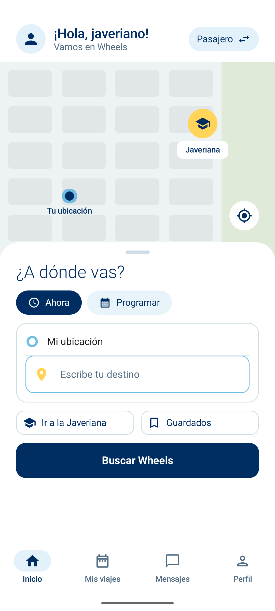 | 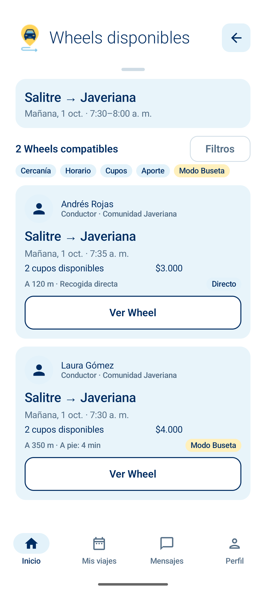 | 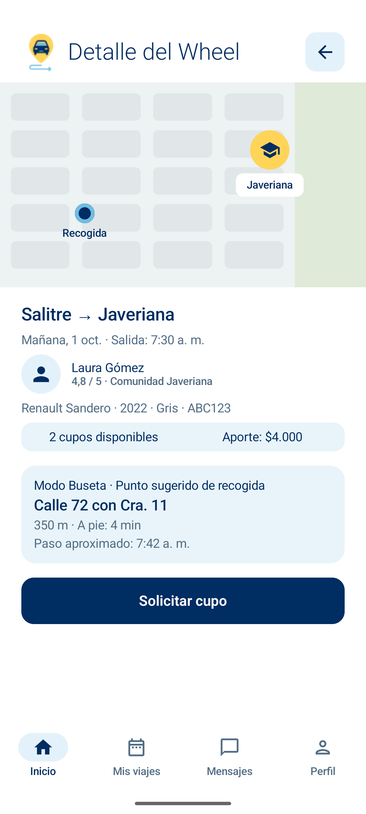 |

| Mis viajes / Reservas | Mis viajes / Mis Wheels | Detalle de reserva |
| --- | --- | --- |
| 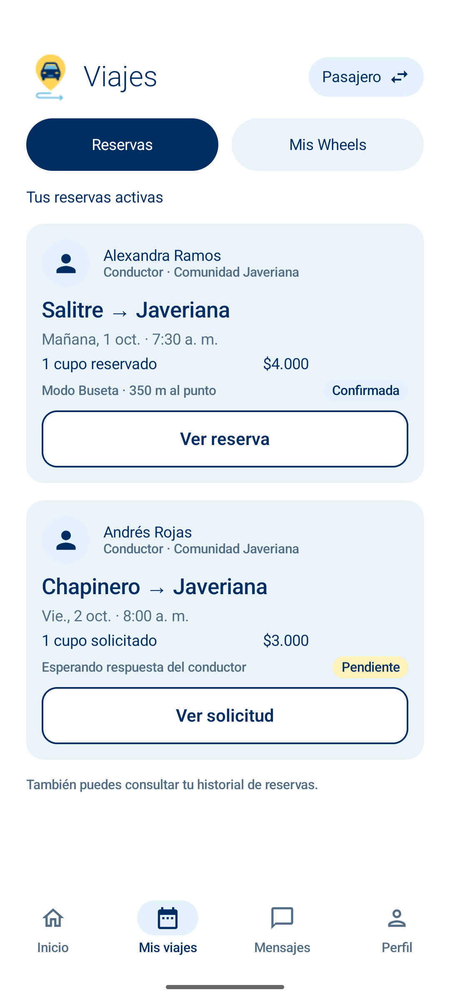 | 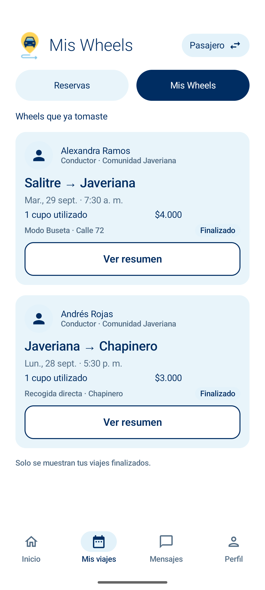 | 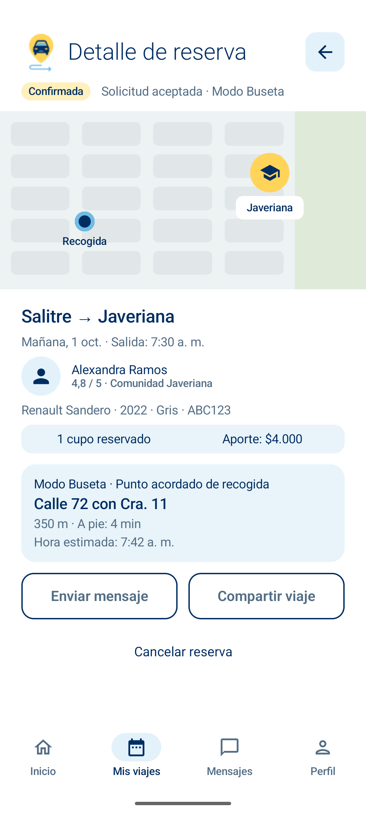 |

| Conductor / Programados | Conductor / Finalizados |
| --- | --- |
| 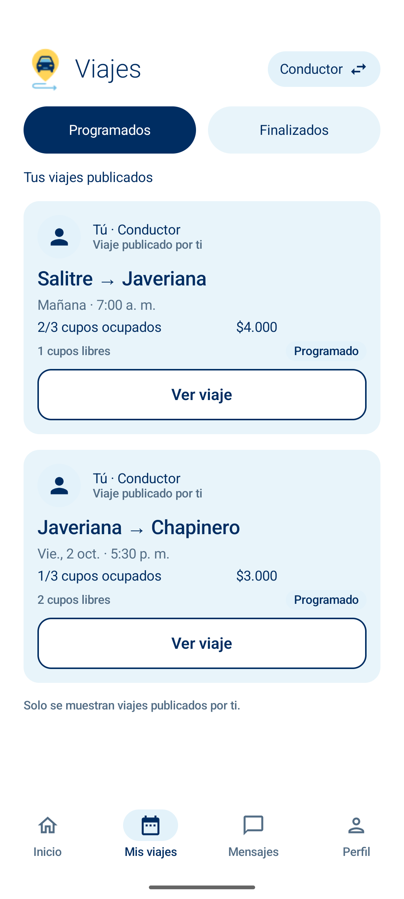 | 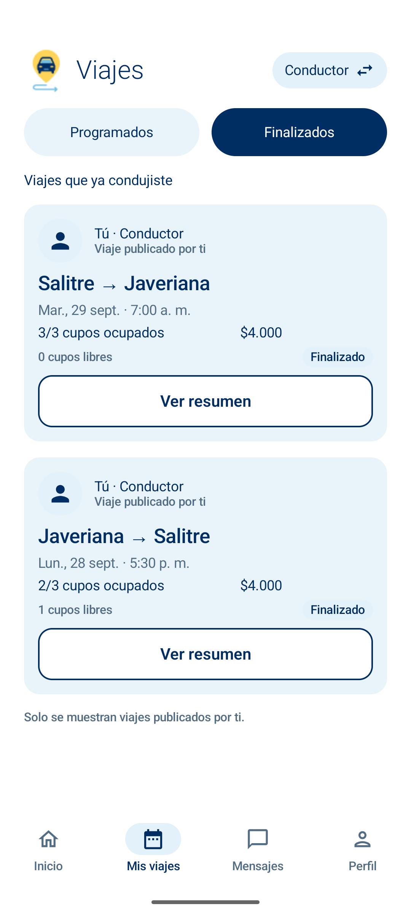 |

| Resumen del pasajero | Rutas guardadas | Filtros |
| --- | --- | --- |
| 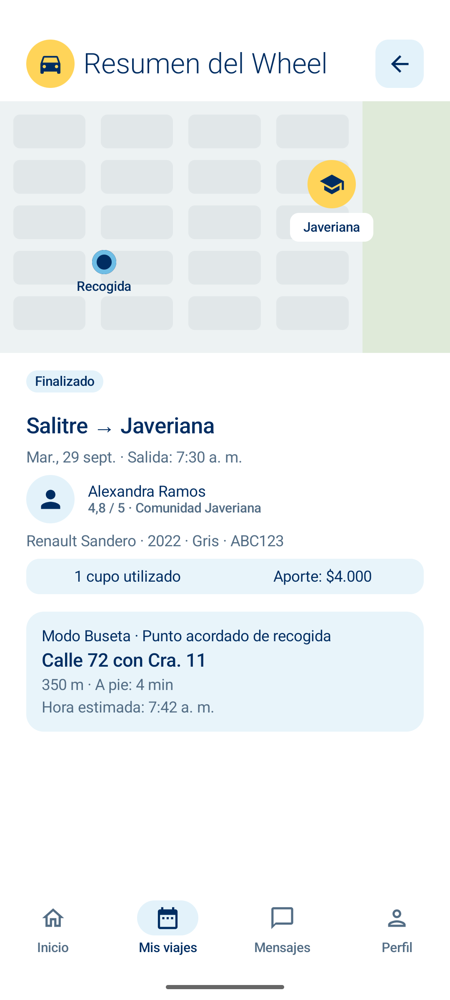 | 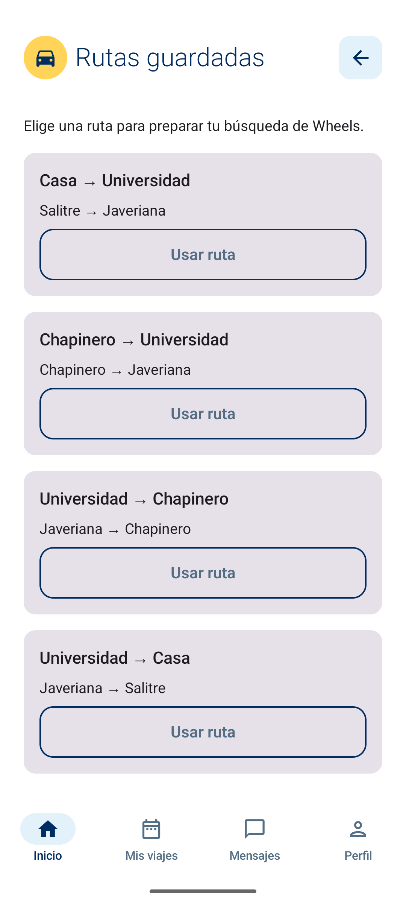 | 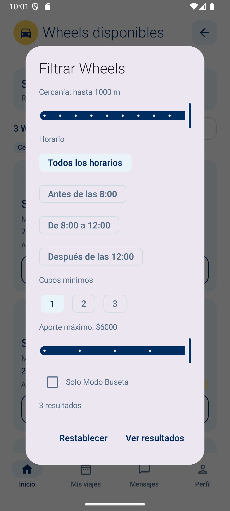 |

| Detalle de viaje publicado | Resumen del conductor |
| --- | --- |
| 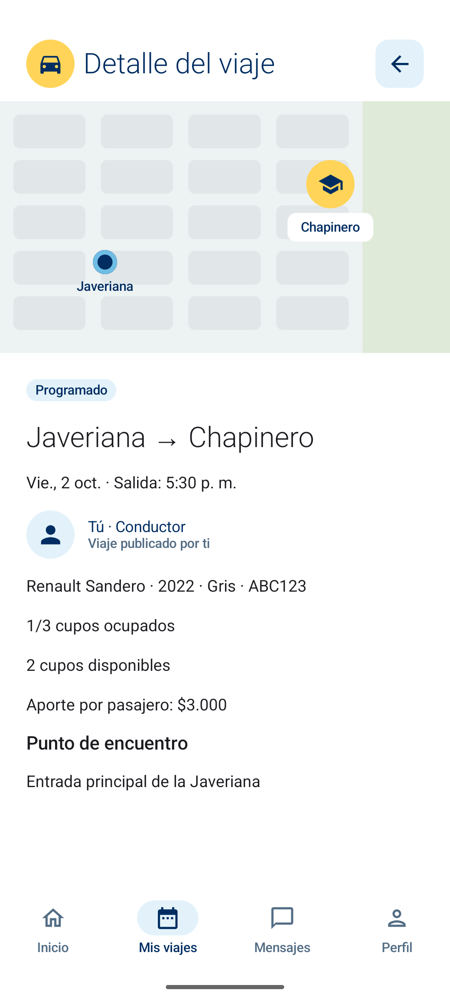 | 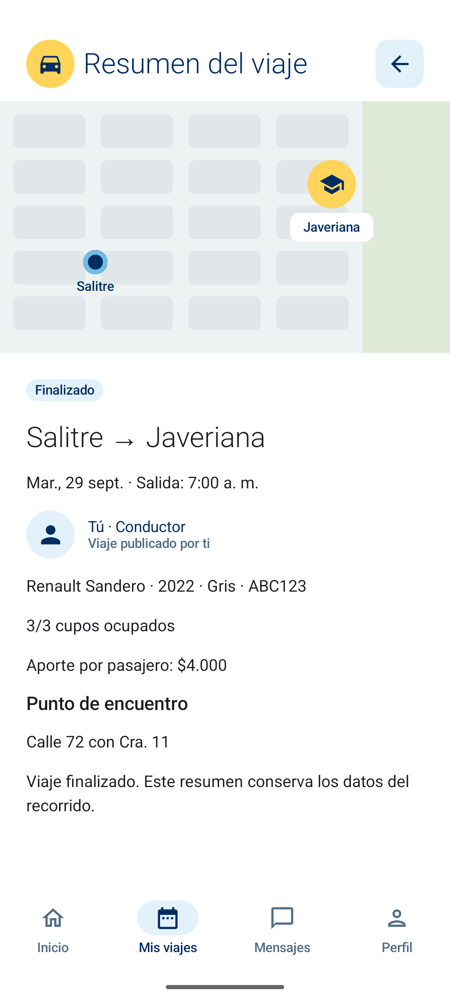 |

## Compilación y validación

El proyecto utiliza Android SDK 37, admite dispositivos desde Android API 24 y se compiló con JDK 25. Configura el SDK en Android Studio y ejecuta desde la raíz del repositorio:

```powershell
.\gradlew.bat :app:assembleDebug
```

El APK de depuración se genera en `app/build/outputs/apk/debug/app-debug.apk`.

La validación del 1 de octubre de 2026 terminó con **BUILD SUCCESSFUL**. Se comprobó en el emulador el flujo del pasajero, ambos roles y sus pestañas, el acceso al registro de conductor, el rol compartido con Inicio y Perfil, los detalles con el mapa reutilizable, los retrocesos y la selección de la barra inferior. La ejecución de `:app:lintDebug` quedó sin resultado al detenerse durante el análisis de comentarios.

## Comprobación de filtros

```powershell
.\gradlew.bat :app:testDebugUnitTest
```

Nueve pruebas verifican fechas, ventanas de búsqueda (incluido el cruce de medianoche), rutas, normalización de zonas, límites de distancia/aporte/cupos, franjas horarias, filtros combinados y restablecimiento sin modificar los datos.

## Estado actual

- Navegación principal y cambio de rol dentro de una misma cuenta.
- Vistas de Wheels, conductor, vehículo, aporte, cupos y recogida.
- Detalle del Wheel seleccionado y navegación hacia Mis viajes.
- Reservas confirmadas y pendientes, historial de Wheels finalizados y detalle de reserva.
- MapaIlustrativo compartido por Inicio y ambos detalles, con altura y marcador configurables.
- LogoJaveWheels dibuja el círculo amarillo y el carro azul con Compose; AvatarUsuario dibuja los avatares con iconos de Compose. Estos componentes no utilizan PNG. SelectorRol se comparte entre Inicio y Mis viajes.
- Resúmenes del historial del pasajero y detalles de los viajes publicados y finalizados del conductor.
- Filtros combinables de cercanía, horario, cupos, aporte y Modo Buseta sobre seis Wheels locales. Los filtros se conservan al volver del detalle y pueden restablecerse.
- Rutas guardadas locales: elegir una completa origen y destino en Inicio; Buscar Wheels muestra recorridos que coinciden con ambos extremos.
- Avisos breves para solicitudes pendientes, mensajería, compartir viaje y cancelar reserva. Estas acciones conservan los datos locales.

## Funcionalidades pendientes

- Backend y autenticación conectada.
- Persistencia de usuarios, vehículos, recorridos y reservas.
- Solicitud y gestión efectiva de cupos.
- Publicación y administración de recorridos del conductor.
- Búsqueda y filtros conectados a recorridos reales; la versión actual filtra únicamente datos locales.
- Mapas, ubicación y seguimiento en tiempo real.
- Mensajería completa y acciones efectivas de compartir y cancelar reservas.

## Buscar ahora y programar

Desde Inicio pasajero, **Ahora** y **Programar** abren formularios con origen y destino editables. Programar agrega selectores de fecha y hora y rechaza horarios pasados. Buscar Wheels abre el formulario del modo confirmado anteriormente. Al confirmar, el resultado usa una ventana de 60 minutos desde la hora elegida y combina todos los filtros existentes. Atrás conserva el formulario al volver de resultados; cancelar el formulario no altera la búsqueda de Inicio.

Los datos de demostración incluyen salidas próximas, mañana y pasado mañana. Fechas distintas pueden no tener resultados. Mi ubicación no usa GPS y permite consultar distintos orígenes. La búsqueda usa la fecha y zona horaria del dispositivo. El mapa sigue siendo ilustrativo.

El reparto del equipo y los pendientes del código se detallan en [Pendientes funcionales](docs/Pendientes_Funcionales.md).
